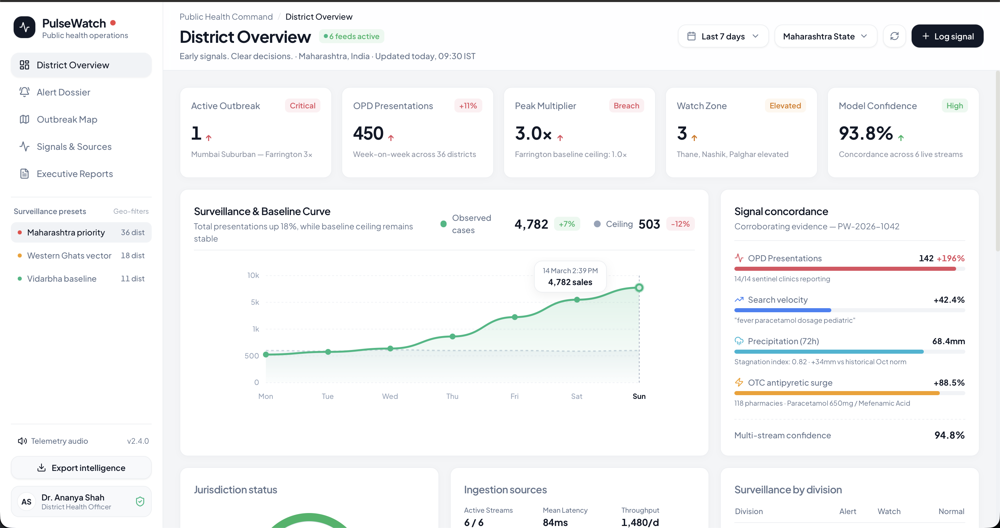
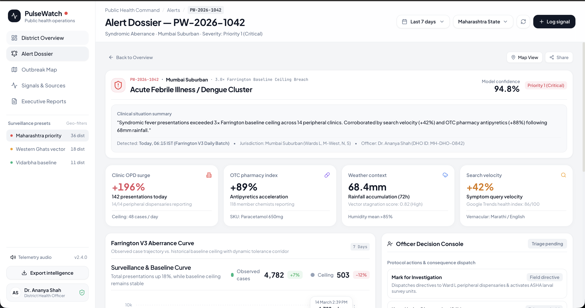
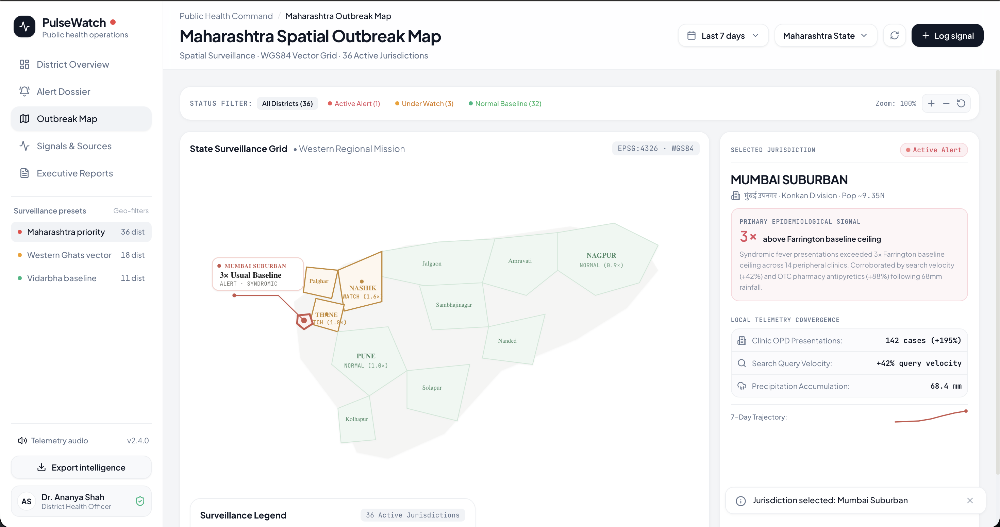

# PulseWatch

**Early Outbreak Detection & Clinical Intelligence Platform**

Developed for CodeAstra 2.0 by Team Syntory.

### Team Syntory
**Soham Mayekar** — Team Lead  
**Devesh Kushe** — Team Member  
**Rudraksha Patil** — Team Member  
**Manya Taleshra** — Team Member

---

## Overview

PulseWatch is a decision-support and early-warning layer for local public-health surveillance. It combines signals that are usually scattered across different sources—clinic counts, public news, search trends, and weather—to identify unusual patterns sooner than traditional weekly reporting workflows.

**Workflow Paradigm:** Collect → Detect → Explain → Alert → Improve

---

## Technical Stack


---

## The Problem

* **Fragmented Information:** Clinics, laboratories, and news sources operate in isolated environments.
* **Delayed Official Reports:** Traditional weekly reporting rhythms fail to identify fast-moving local clusters.
* **Unexplained Alerts:** Existing dashboards provide arbitrary metrics without explaining the underlying reasoning.

---

## The Solution

PulseWatch introduces a unified telemetry pipeline that aggregates multiple sources, computes risk levels daily at the district level, and delivers human-readable explanations alongside every generated alert.

* **Multi-Signal Detection:** Integrates sentinel clinic counts, localized news natural language processing (NLP), search velocity, and meteorological grid data.
* **Explainable Alerts:** Translates anomalies into plain-language reasoning with corroborating evidence and confidence scores.
* **Human-in-the-Loop:** Health officers must review anomalies and append field notes before public advisories are authorized.
* **Privacy by Design:** Architected for DPDPA 2023 compliance, utilizing exclusively aggregated district-level counts with zero PII exposure.

---

## System Interfaces

### Executive Dashboard
The centralized operations center for observing real-time signal pipelines, active outbreak locations, and multi-stream confidence scores.



### Alert Dossier
A detailed investigative view for a specific alert, containing the Farrington statistical curve and contributing evidence.



### Geospatial Outbreak Map
A district-level mapping interface utilizing MapLibre to visually represent isolated geographic clusters.



---

## Local Development

1. **Clone the repository**
   ```bash
   git clone https://github.com/SohamMayekar/pulsewatch.git
   cd pulsewatch
   ```

2. **Install dependencies**
   ```bash
   npm install
   ```

3. **Start the development server**
   ```bash
   npm run dev
   ```

4. **Access the platform**  
   Navigate to `http://localhost:3001` in your browser.
